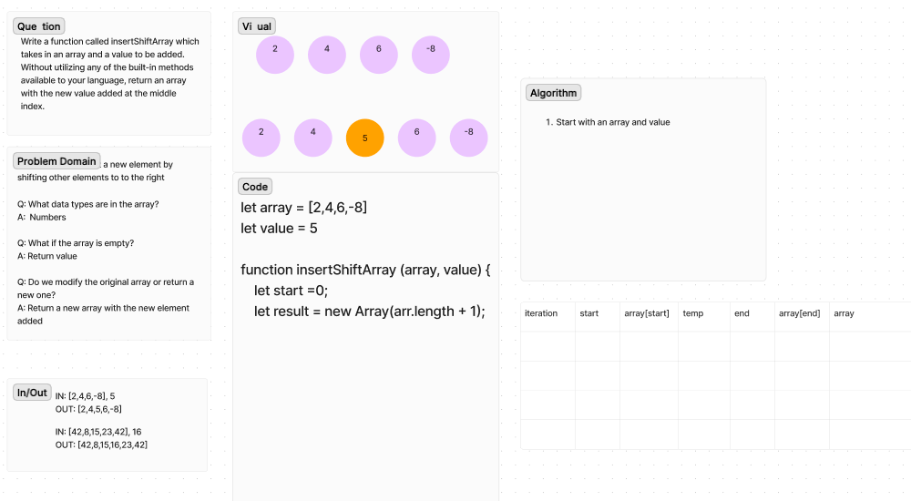

# Code Challenge: Class 02 - Insert Shift ArrayCC02

Write a function called `insertShiftArray` which takes in an array and a value to be added. Without utilizing any of the built-in methods available to your language, return an array with the new value added at the middle index.

## Whiteboard Process
[Whiteboard Process](https://codefellows.github.io/common_curriculum/challenges/code/whiteboarding)

## Approach & Efficiency
<!-- What approach did you take? Why? What is the Big O space/time for this approach? -->

## Solution
No code required