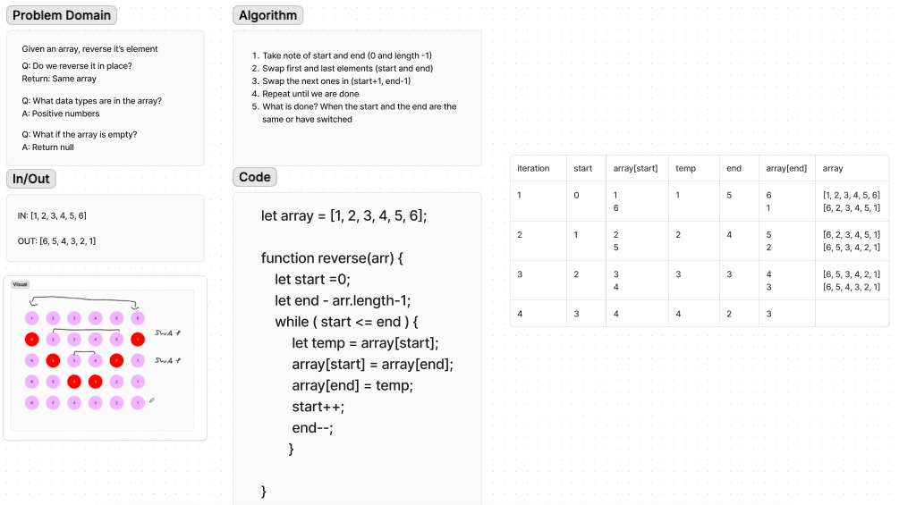

# Code Challenge: Class 01 - Reverse an Array
Write a function called reverseArray which takes an array as an argument. Without utilizing any of the built-in methods available to your language, return an array with elements in reversed order.

## Whiteboard Process
[Whiteboard Process](https://codefellows.github.io/common_curriculum/challenges/code/whiteboarding)

## Approach & Efficiency
<!-- What approach did you take? Why? What is the Big O space/time for this approach? -->

## Solution
No code required